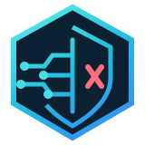

<p align="center">
  
</p>

# Blockinator

**Blockinator** is a self-hosted DNS policy engine and management console for DNS servers, including Technitium through the [companion plugin](https://github.com/StealthCat/blockinator-technitium). The DNS server sends authenticated query metadata; Blockinator returns an allow/block decision. Blockinator does not replace the DNS server or resolve DNS queries itself.

Current source version: **1.20.4**. See the [changelog](CHANGELOG.md) and [published releases](https://github.com/StealthCat/blockinator-web/releases). The recommended source installation tracks stable `main`; unreleased application changes belong on `dev`. The current published release is **[v1.20.1](https://github.com/StealthCat/blockinator-web/releases/tag/v1.20.1)**, with Docker image **1.20.1**. Source versions can include later documentation updates without a new release.

## Features

- Block lists and whitelists from URLs, uploads, pasted rules, or manual entries.
- IPv4/IPv6 networks, exact client IPs, and exact/wildcard PTR hostname targets, including schedule-aware whitelisted targets.
- Weekly schedules with IANA timezones, global pause, unmatched-client defaults, and ignored DNS question types.
- Policy Tester with rule explanations, searchable target editors, query shortcuts, and form recovery after failed saves.
- Searchable query history, response-time metrics, retained statistics, and background PTR identity learning.
- System, dark, and light themes with responsive layouts.
- SQLite by default, optional MySQL 8.x, and a verified offline migration tool.
- Administrator accounts, named API keys, and managed HTTPS through Caddy using uploaded certificates or ACME.

## Documentation

| Guide | Contents |
| --- | --- |
| [Quick start](#quick-start-git-clone-and-docker-compose-recommended) | Recommended source-built Compose installation and updates |
| [Docker Hub installation](docs/INSTALLATION.md) | Prebuilt Compose or standalone Docker, upgrades, and startup troubleshooting |
| [User guide](docs/USER_GUIDE.md) | Policy precedence, lists, schedules, targets, Policy Tester, query history, and appearance |
| [Operations and configuration](docs/OPERATIONS.md) | Databases, migration, HTTPS, environment variables, monitoring, and backups |
| [Resolver integration and API](docs/API.md) | Technitium configuration, authentication, payloads, and mixed-question behavior |
| [Development and releases](docs/DEVELOPMENT.md) | Architecture, tests, benchmarks, versioning, and Docker Hub publishing |

## Quick start: Git clone and Docker Compose (recommended)

This is the primary installation method. It builds the application from the
stable `main` branch and starts it alongside Caddy. Requirements: Docker Engine,
Docker Compose v2, Git, Bash, and OpenSSL. Run these commands on the Docker host;
use `sudo` for Docker if your account requires it.

### 1. Clone the repository

```bash
git clone https://github.com/StealthCat/blockinator-web.git
cd blockinator-web
```

`main` is the default branch and contains stable application code and current
documentation. To pin an exact release instead, see [Fixed-version installation](#fixed-version-installation-optional).

### 2. Create first-run credentials

For a **new installation**, run this Bash block to create a private `.env` file
with randomly generated credentials. It refuses to overwrite an existing file.

```bash
(
  set -eu
  umask 077
  set -o noclobber
  admin_password=$(openssl rand -hex 24)
  policy_api_key=$(openssl rand -hex 32)
  cat > .env <<EOF
ADMIN_USERNAME=admin
ADMIN_PASSWORD=$admin_password
POLICY_API_KEY=$policy_api_key
DATABASE_BACKEND=sqlite
TZ=UTC
POLICY_PORT=8080
HTTPS_PORT=8443
EOF
)
```

If `.env` already exists, keep it and edit the required values instead. Optional
settings are listed in [.env.example](.env.example). Set `TZ` to your IANA timezone, such as
`America/New_York`. The admin password must be at least **12 characters**, and
the policy API key at least **24 characters**; known example credentials are rejected.

View the generated credentials locally when needed:

```bash
cat .env
```

Keep this file private. Once the database is initialized, change credentials in
**Access & Security**. Changing `.env` does not reset existing database credentials.

### 3. Build and start Blockinator

```bash
docker compose up -d --build
```

Compose builds Blockinator locally and pulls the Caddy image. No Docker Hub
override file is needed. SQLite is the default; for MySQL, configure `.env` using
[MySQL setup](docs/OPERATIONS.md#mysql) before starting.

### 4. Open and configure Blockinator

Open **`http://DOCKER-HOST:8080/`** and sign in as `admin` using the password in
`.env`. Create your networks/endpoints, add block lists or whitelists, and configure
the [companion Technitium plugin](https://github.com/StealthCat/blockinator-technitium) with:

- **Endpoint:** `http://DOCKER-HOST:8080/api/v1/decision`
- **API key:** the `POLICY_API_KEY` value from `.env`, or a key created in **Access & Security**.

For HTTPS, open **System Settings → HTTPS & TLS**, then configure an uploaded
certificate or ACME. See [HTTPS and TLS](docs/OPERATIONS.md#https-and-tls) for hostname, port, and
certificate settings. The default HTTPS port is `8443`; setting `HTTPS_PORT=443`
and `POLICY_PORT=80` in `.env` uses standard host ports after recreating the stack.
ACME validation must be reachable at the ports required by your chosen CA.

SQLite data is persisted at `./data/policy.db`; TLS files and Caddy state are also
under `./data`. Preserve that directory and `.env` when recreating containers.
The Caddy admin API and application port stay inside the Compose network.

Check status and logs:

```bash
docker compose ps
docker compose logs --tail=100 blockinator caddy
```

### Updating a Git clone installation

Back up `.env` and `./data` before updating (stop the stack for a consistent SQLite
backup); back up remote MySQL separately if used. From the existing project directory
on `main`:

```bash
docker compose stop
# Back up .env and ./data now; back up remote MySQL separately if used.
git pull --ff-only
docker compose up -d --build
```

Keep the same project directory and persistent data, and review release notes for
configuration changes before upgrading. Preserve local edits; if Git reports a
conflict or divergent history, resolve it without forcing or resetting the checkout.
[Docker Hub deployments have separate update steps](docs/INSTALLATION.md#updating-an-existing-docker-hub-deployment).

### Moving an existing tag checkout to main

If you used the earlier tag-based instructions, back up first and run these commands
from the existing checkout before using the update procedure above. This also adds
`main` to the fetch configuration of a `--single-branch` tag clone:

```bash
git remote set-branches --add origin main
git fetch origin
git switch main
git pull --ff-only
```

### Fixed-version installation (optional)

To build the exact published release instead of tracking stable updates:

```bash
git clone --branch v1.20.1 --single-branch https://github.com/StealthCat/blockinator-web.git
cd blockinator-web
```

Continue with [first-run credentials](#2-create-first-run-credentials) and the
remaining setup steps above. A detached HEAD is normal when checking out a tag.
For a later release, stop and back up the deployment, replace `v1.20.1` in both
commands below with the desired published tag, then rebuild:

```bash
git fetch origin tag v1.20.1
git checkout --detach v1.20.1
docker compose up -d --build
```

Tag-based installations use explicit tag changes instead of `git pull`.

## Alternative: Docker Hub

Use [the Docker Hub installation guide](docs/INSTALLATION.md) for the prebuilt `stealthcat128/blockinator` image. Compose with Caddy supports managed HTTPS; standalone Docker serves HTTP. There is no default first-run password.

## First steps

1. Create a block list or whitelist and choose whether it applies globally or to selected targets.
2. Add policy targets for your networks, client IPs, or learned PTR hostnames.
3. Use **Policy Tester** to check an expected decision before relying on the policy.
4. Configure the resolver endpoint/API key, then verify activity in **Query Log** and **Statistics**.
5. Configure HTTPS and review the [backup and monitoring guidance](docs/OPERATIONS.md).

## License

Blockinator is licensed under the **GNU General Public License v3.0**. See [LICENSE](LICENSE) for the full license text.

## Reddit User Reviews

Selected feedback from the r/technitium community:

> “Vibe coded slop.  
> Hard pass.”  
> — u/Resistant4375

> “AI Slop.”  
> — Anonymous

> “So, built a $20 a month app.”  
> — u/Superb_Raccoon

> “Thanks ChatGPT!”  
> — u/Key_Pace_2496

> “it deserves to be called slop. I’d argue that “slop” is too kind”  
> — Anonymous
